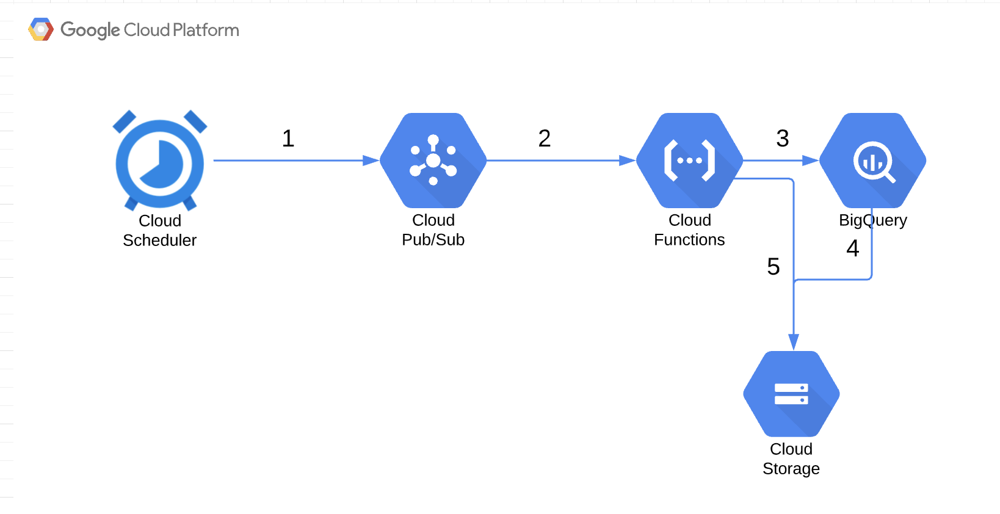

# billing_export_bq_gcs
This is a POC for scheduling daily exports of Google Cloud billing data to GCS after processing it in BigQuery.
At the end of this setup the architecture will look as follows:



### Requirements
1. Existing BigQuery dataset that has your billing data
2. Existing bucket where you wish to send your data

### Steps

1. Create a pubsub topic:

```shell
gcloud pubsub topics create billing_export
```

2. Create a Cloud function that subscribes to PUB/SUB topic(billing_export):

This Cloud function ships all the billing data of the day before the date when the function was run from the billing BigQuery dataset to a file inside a bucket you specify.

If you trigger the cloud function multiple times, it will simply replace the billing export file for the day before with the latest billing data in the BigQuery dataset.

```shell
gcloud functions deploy export_billing --runtime python37 --trigger-topic billing_export --set-env-vars BQ_PROJECT_ID='{BQ project ID}',BQ_DATASET='{billing dataset name}',BQ_TABLE='{billing table name}',BILLING_BUCKET_NAME='{billing bucket name}'
```

3. Trigger the Cloud function by publishing a message to the billing_export topic to test everything is working:
`NOTE:` if you wish to query more than one day, you can pass the desired number of days to take into account in the message field.  For example to query the last 30 days not including the current day, run the following command:

```shell
gcloud pubsub topics publish billing_export --message=30
```

4. Create a cloud scheduler job to schedule a daily export(21:00 UTC) of last day billing data by publishing a message to the billing_export pubsub topic:

```shell
gcloud scheduler jobs create pubsub daily_billing_export --schedule "0 21 * * *" --topic billing_export --message-body=1
```
